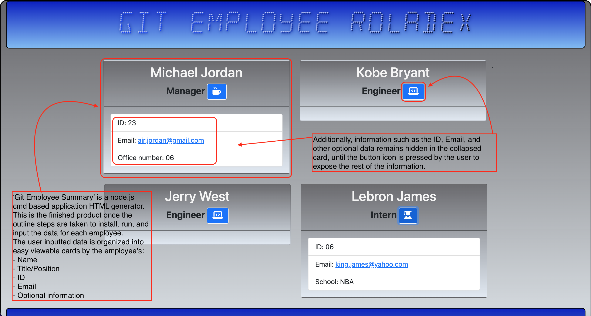

# **Git Employee Summary**
---
>[](#isc-license)

## Overview
---
**'Git Employee Summary'** is a ```node.js``` command-line application using dynamic JavaScript with a dependency on ```Inquirer v8.2.4``` that takes in information about employees on a software engineering team, then generates an ```HTML``` webpage that displays summaries for each employee. 
Testing powered by ```Jest``` plays a key role to making code maintainable, with a unit test available for every part to ensure functionality.

This user-friendly and intuitive application will allow users to create a virtual roladex of employee summaries with ease. Lastly, the 'video walkthrough' will serve as a guide to full functionality and application.

## Table of Contents
---

  * [Overview](#overview)
  * [User Story](#user-story)
  * [Acceptance Criteria](#acceptance-criteria)
  * [Installation](#installation)
  * [Mock Up](#mock-up)
  * [Video Walkthrough](#video-walkthrough)
  * [GitHUB Repository](#github-repository)
  * [Evaluation Guideline](#evaluation-guideline)
  * [Questions](#questions)
  * [License](#isc-license)

## User Story
---

```md
AS A manager
I WANT to generate a webpage that displays my team's basic info
SO THAT I have quick access to their emails and GitHub profiles
```

## Acceptance Criteria
---

> **Note:** The following criteria is used to determine if the standards set for **'Git Employee Summary'** have been met:

```md
GIVEN a command-line application that accepts user input
WHEN I am prompted for my team members and their information
THEN an HTML file is generated that displays a nicely formatted team roster based on user input
WHEN I click on an email address in the HTML
THEN my default email program opens and populates the TO field of the email with the address
WHEN I click on the GitHub username
THEN that GitHub profile opens in a new tab
WHEN I start the application
THEN I am prompted to enter the team manager’s name, employee ID, email address, and office number
WHEN I enter the team manager’s name, employee ID, email address, and office number
THEN I am presented with a menu with the option to add an engineer or an intern or to finish building my team
WHEN I select the engineer option
THEN I am prompted to enter the engineer’s name, ID, email, and GitHub username, and I am taken back to the menu
WHEN I select the intern option
THEN I am prompted to enter the intern’s name, ID, email, and school, and I am taken back to the menu
WHEN I decide to finish building my team
THEN I exit the application, and the HTML is generated
```

## Installation
----

**Important**: It is recommended that you start with a directory structure that looks like the following example:

```
md
.
├── __tests__/             //jest tests
│   ├── Employee.test.js
│   ├── Engineer.test.js
│   ├── Intern.test.js
│   └── Manager.test.js
├── dist/                  // rendered output (HTML) and CSS style sheet      
├── lib/                   // classes
├── src/                   // template helper code 
├── .gitignore             // indicates which folders and files Git should ignore
├── index.js               // runs the application
└── package.json           
```

> **Note:** Install and run this application by entering the following cmd lines in terminal:

```
npm install
```
-followed by-

```
npm i inquirer@8.2.4
```
-followed by-
```
node index.js
```
> **Important:** For troubleshooting issues the use of ```Jest``` is recommended by running the cmd line below on the ```_test_``` directory:

```
'npm run test'
```

## Mock-Up
---

> **Note**: The following images show a mock-up of **'Git Employee Summary'**, the generated HTML’s appearance, and functionality:



> **Note**: The following images show a mock-up of the installation, test, and running of the application:

* **Installation:**


* **Running Tests:**


* **App Prompt(s):**


* **Error Hard Stop:**


* **Complete Run:**


## Video Walkthrough
---
> **Note:** The following link will display a video which depicts the functionality of the **'Git Employee Summary'** application:

https://aasports89.github.io/git-employee-summary-walkthrough/

## GitHUB Repository
---

https://github.com/AASports89/git-employee-summary


## Evaluation Guideline
---

> **Note**: The following evaluation guideline is used to determine if **'Git Employee Summary'** meets the requirements for a minimum viable product:

### Deliverables: 15%

* A sample HTML file generated using the application must be submitted.

* Your GitHub repository containing your application code.

### Walkthrough Video: 32%

* A walkthrough video that demonstrates the functionality of the Team Profile Generator and passing tests must be submitted, and a link to the video should be included in your README file.

* The walkthrough video must show all four tests passing from the command line.

* The walkthrough video must demonstrate how a user would invoke the application from the command line.

* The walkthrough video must demonstrate how a user would enter responses to all of the prompts in the application.

* The walkthrough video must demonstrate a generated HTML file that matches the user input.

### Technical Acceptance Criteria: 40%

* Satisfies all of the preceding acceptance criteria plus the following:

  * Uses the [Inquirer package](https://www.npmjs.com/package/inquirer/v/8.2.4).

  * Uses the [Jest package](https://www.npmjs.com/package/jest) for a suite of unit tests.

  * The application must have `Employee`, `Manager`, `Engineer`, and `Intern` classes.

### Repository Quality: 13%

* Repository has a unique name.

* Repository follows best practices for file structure and naming conventions.

* Repository follows best practices for class/id naming conventions, indentation, quality comments, etc.

* Repository contains multiple descriptive commit messages.

* Repository contains a high-quality readme with description and a link to a walkthrough video.

## Review

You are required to submit the following for review:

* A walkthrough video that demonstrates the functionality of the application and passing tests.

* A sample HTML file generated using your application.

* The URL of the GitHub repository, with a unique name and a readme describing the project.

## Questions
---
> **Note:** For any troubleshooting and/or functionality related questions, please visit my GitHUB @https://github.com/AASports89.

## **ISC License**
---
**Copyright © 2022 - AASports89**

Permission to use, copy, modify, and/or distribute this software for any purpose with or without fee is hereby granted, provided that the above copyright notice and this permission notice appear in all copies.

THE SOFTWARE IS PROVIDED "AS IS" AND THE AUTHOR DISCLAIMS ALL WARRANTIES WITH REGARD TO THIS SOFTWARE INCLUDING ALL IMPLIED WARRANTIES OF MERCHANTABILITY AND FITNESS. IN NO EVENT SHALL THE AUTHOR BE LIABLE FOR ANY SPECIAL, DIRECT, INDIRECT, OR CONSEQUENTIAL DAMAGES OR ANY DAMAGES WHATSOEVER RESULTING FROM LOSS OF USE, DATA OR PROFITS, WHETHER IN AN ACTION OF CONTRACT, NEGLIGENCE OR OTHER TORTIOUS ACTION, ARISING OUT OF OR IN CONNECTION WITH THE USE OR PERFORMANCE OF THIS SOFTWARE.

---
---